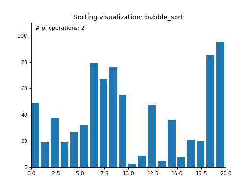

# Sorting Algorithms Visualized in Python

This script used to generate animation `.gif` images, which visualize sorting algorithms (bubble, quick, heap, merge sort).

The sample output:

Bubble sort

# Prerequisites
- Install [Python 3](https://www.python.org/downloads/), which is required because of using `yeild from` feature.
- Install `matplotlib` package by pip
```
$ python3 -m pip install matplotlib
```
- If you need to generate `.gif` file (as line 185, `sort.py` file), please install [imagemagick](https://imagemagick.org/script/download.php)

# Usage

Please use the following paramater to custom the animation:
```
$ python3 sort.py --help
usage: sort.py [-h] [-as ARRAY_SIZE] [-st SORT_TYPE] [-i INTERVAL] [-o OUTPUT]

optional arguments:
  -h, --help            show this help message and exit
  -as ARRAY_SIZE, --array_size ARRAY_SIZE
                        Size of array which will be sorted
  -st SORT_TYPE, --sort_type SORT_TYPE
                        Sort type: bubble, quick, heap, merge
  -i INTERVAL, --interval INTERVAL
                        Interval time between 2 operations
  -o OUTPUT, --output OUTPUT
                        Output file name

# Example
$ python3 sort.py -as 100 --sort_type=quick -i 300 -o quick_sort.gif
```

Is it simple? Have fun! :D